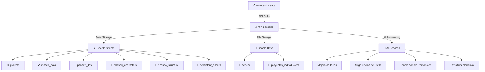

# 🎭 **GENERADOR NARRATIVO CON IA - SISTEMA INTEGRAL** 

## 🎯 **Descripción del Proyecto**

Sistema web integral que conecta con **n8n** como backend para generar contenido narrativo de alta calidad. El sistema permite crear historias individuales o series con **coherencia narrativa adaptativa**, **persistencia de contexto** y **gestión inteligente de activos**.

### ✨ **Características Principales**

- 🔄 **Gestión de Proyectos Inteligente**: Nuevo, Continuación o Serie/Capítulos
- 🎨 **Generación Asistida por IA**: Mejora automática de ideas y sugerencias contextuales
- 📚 **Persistencia de Series**: Mantiene coherencia entre capítulos
- 🎭 **Gestión de Personajes**: Evolución controlada con rasgos persistentes
- 🔄 **Backend n8n**: Flujos automatizados para procesamiento IA
- 📊 **Google Sheets**: Base de datos normalizada con relaciones
- 📁 **Google Drive**: Almacenamiento jerárquico de activos

---

## 🏗️ **Arquitectura del Sistema**



---

## 📋 **Fases del Sistema**

### **🌟 Fase 1: La Idea Principal**
- ✍️ **Tu Idea** (obligatorio): Concepto base del usuario
- 🤖 **Generación con IA**: Mejora automática con claridad y coherencia
- 🎯 **Público Objetivo** (opcional): Demografía específica
- 🔑 **Elementos Clave** (opcional): Tags separados por comas
- 📚 **Continuidad de Serie**: Notas automáticas para proyectos secuenciales

### **🎨 Fase 2: Estilo y Formato**

#### **📺 Formatos de Salida**
- **Video (Redes Sociales)**: TikTok/Reels, Video Cuadrado, Twitter/X, Anuncios
- **Video (Cinematográfico)**: Cortometrajes, Tráilers, Videos Musicales, Series
- **Contenido Estático**: Carruseles, Cómics, Storyboards, Infografías
- **Contenido Interactivo**: Historias Twine, AR Filters, Podcasts, Juegos ARG
- **Formatos Experimentales**: Slideshow, GIFs, Narrativa con Memes, Webtoons

#### **🎭 Estilos Narrativos**
- **Géneros Clásicos**: Comedia, Drama, Misterio, Terror, Sci-Fi, Fantasía
- **Subgéneros**: Cyberpunk, Steampunk, Film Noir, Realismo Mágico
- **Tonos**: Nostálgico, Satírico, Contemplativo, Onírico
- **Experimentales**: Surrealista, Meta-narrativo, No Lineal

#### **🎬 Estilos Visuales**
- **Cinematográfico**: Hiperrealista, Film Noir, Teal & Orange, Wes Anderson
- **Animación**: Studio Ghibli, Pixar 3D, Spider-Verse, Tim Burton
- **Artístico**: Óleo, Acuarela, Pop Art, Impresionismo, Surrealismo
- **Retro/Vintage**: Polaroid 70s, VHS 80s, Blanco y Negro
- **Moderno**: Cyberpunk Neón, Glitch Art, Vaporwave, Minimalista

#### **📚 Estructuras Narrativas**
- Viaje del Héroe, Tres Actos, No Lineal, In Media Res
- Ganchos: Curiosidad, Emocionales, Sensoriales
- Conflictos: Interno, Interpersonal, Social, Ambiental
- Finales: Feliz, Trágico, Abierto, Plot Twist, Meta-finales

#### **⚡ Nivel de Energía**: Escala 1-10 (Contemplativo → Frenético)

### **👥 Fase 3: Personajes**
- **📝 Definición Completa**: Nombre, Tipo, Descripción detallada
- **🎯 Motivaciones**: Deseo, Miedo, Necesidad, Defecto Crítico
- **📈 Arco Narrativo**: Evolución del personaje
- **🎨 Detalles Visuales**: Descripción específica para IA
- **🔗 Persistencia**: Rasgos que se mantienen entre capítulos
- **🤖 Generación IA**: Sugerencias automáticas de elenco
- **🖼️ Gestión de Imágenes**: Upload y referencias visuales

### **📖 Fase 4: Estructura Narrativa**
- **🎬 Acto 1**: Planteamiento - Personajes, mundo, incidente incitador
- **⚔️ Acto 2**: Confrontación - Obstáculos crecientes, punto medio, clímax del acto
- **🎯 Acto 3**: Resolución - Clímax final, consecuencias, nuevo normal
- **🔄 Continuidad**: Elementos persistentes entre capítulos
- **🤖 Generación IA**: Estructura optimizada automáticamente

---

## 🔄 **Gestión de Series y Coherencia**

### **📊 Tipos de Proyecto**
1. **🆕 Nuevo**: Historia completamente nueva
2. **🔄 Continuación**: Reanudar proyecto existente
3. **📚 Serie/Capítulo**: Nueva entrega manteniendo coherencia

### **🧠 Coherencia Narrativa Adaptativa**
- **🔍 Detección Automática**: Análisis de cambios de estilo
- **⚖️ Clasificación**: Compatibles, Incompatibles, Prohibidos
- **📝 Justificaciones**: Explicaciones narrativas automáticas
- **🔒 Reglas de Persistencia**: Elementos que no pueden cambiar

### **📁 Estructura de Archivos**
```
📁 Proyectos/
├── 📁 series/
│   └── 📁 serie_id/
│       ├── 📁 capitulo_1/
│       │   ├── 📁 Personajes/
│       │   ├── 📁 Activos_Persistentes/
│       │   └── project_context.json
│       └── 📁 capitulo_2/
└── 📁 proyectos_individuales/
```

---

## 📾 **Base de Datos (Google Sheets)**

### **📊 Tablas Principales**

#### **🗂️ projects** (Tabla Principal)
- `project_id`, `parent_project_id`, `project_type`
- `series_id`, `series_name`, `chapter_number`
- `continuity_level`, `style_changes_json`
- `persistent_assets_json`, `status`

#### **💡 phase1_data** (Ideas)
- `idea`, `improved_idea`, `target_audience`
- `key_elements`, `series_continuity_notes`

#### **🎨 phase2_data** (Estilo y Formato)
- `output_formats`, `narrative_styles`, `visual_styles`
- `narrative_structures`, `energy_level`
- `parent_styles_json`, `style_change_justifications`

#### **👥 phase3_characters** (Personajes)
- `name`, `type`, `description`, `desire`, `fear`
- `character_arc`, `visual_details`, `image_url`
- `persistent_traits`, `evolved_traits`, `is_persistent`

#### **📖 phase4_structure** (Estructura)
- `act1_setup`, `act2_confrontation`, `act3_resolution`
- `series_continuity_elements`, `ai_generated_structure`

#### **🔗 persistent_assets** (Activos Persistentes)
- `asset_type`, `asset_name`, `asset_description`
- `is_persistent`, `persistence_rules`

---

## 🛠️ **Stack Tecnológico**

### **Frontend**
- ⚛️ **React 18** con Hooks
- 🎨 **Tailwind CSS** para estilos
- 📱 **Responsive Design**
- 🔄 **Estado Global** con Context API
- 📋 **Formularios** con validación

### **Backend**
- 🔄 **n8n** como motor de workflows
- 📊 **Google Sheets API** para persistencia
- 📁 **Google Drive API** para archivos
- 🤖 **Integración con APIs de IA**
- 🔐 **OAuth 2.0** para autenticación

### **Servicios Externos**
- 🧠 **OpenAI/Gemini** para procesamiento IA
- ☁️ **Google Workspace** para almacenamiento
- 🖼️ **Servicios de Imágenes** para generación visual

---

## 🚀 **Instalación y Configuración**

### **📋 Prerrequisitos**
- Node.js 18+
- npm/yarn
- Cuenta Google (Sheets + Drive)
- Instancia n8n
- APIs de IA configuradas

### **⚙️ Configuración Inicial**

1. **📥 Clonar Repositorio**
```bash
git clone https://github.com/juancspjr/AC1.git
cd AC1
```

2. **📦 Instalar Dependencias**
```bash
npm install
```

3. **🔧 Configurar Variables de Entorno**
```bash
cp .env.example .env
# Editar .env con tus credenciales
```

4. **📊 Configurar Google Sheets**
- Crear hoja de cálculo con las tablas especificadas
- Configurar permisos de API
- Obtener credenciales OAuth

5. **🔄 Configurar n8n**
- Importar workflows desde `/n8n-workflows/`
- Configurar credenciales de APIs
- Activar webhooks

6. **🚀 Ejecutar Aplicación**
```bash
npm start
```

---

## 📈 **Roadmap de Desarrollo**

### **🎯 Fase Actual: Fases 1-4**
- [x] ✅ Arquitectura del sistema
- [x] ✅ Base de datos normalizada
- [x] ✅ Diseño de coherencia narrativa
- [x] ✅ Implementación Frontend React
- [x] ✅ Hooks para n8n
- [x] ✅ Servicios de API
- [x] ✅ Sistema de coherencia visual
- [x] ✅ Testing y optimización

### **🔮 Próximas Fases**
- **Fase 5**: Generación de contenido con agentes IA
- **Fase 6**: Exportación y distribución
- **Fase 7**: Analytics y optimización
- **Fase 8**: Colaboración en tiempo real

---

## 🧪 **Testing y Calidad**

### **📊 Cobertura de Tests**
- Tests unitarios para hooks y componentes
- Tests de integración para flujos completos
- Tests de UI para experiencia de usuario
- Tests de API para servicios backend

### **🔍 Herramientas de Calidad**
- ESLint para código consistente
- Prettier para formateo automático
- Jest para testing
- React Testing Library para tests de componentes

---

## 🤝 **Contribución**

### **📝 Cómo Contribuir**
1. Fork del repositorio
2. Crear branch feature (`git checkout -b feature/nueva-funcionalidad`)
3. Commit cambios (`git commit -am 'Agregar nueva funcionalidad'`)
4. Push al branch (`git push origin feature/nueva-funcionalidad`)
5. Crear Pull Request

### **💻 Desarrollo Local**
```bash
# Comandos útiles
npm run dev          # Servidor de desarrollo
npm run build        # Build para producción
npm run test         # Ejecutar tests
npm run lint         # Verificar código
npm run format       # Formatear código
npm run test:coverage # Cobertura de tests
```

---

## 📞 **Soporte y Contacto**

- **Issues**: [GitHub Issues](https://github.com/juancspjr/AC1/issues)
- **Documentación**: [Wiki del proyecto](https://github.com/juancspjr/AC1/wiki)
- **Ejemplos**: Carpeta `/examples/` con casos de uso

---

## 📄 **Licencia**

Este proyecto está bajo la licencia MIT. Ver `LICENSE` para más detalles.

---

**¡Empieza a crear narrativas extraordinarias con el poder de la IA y la coherencia narrativa adaptativa!** 🎬✨